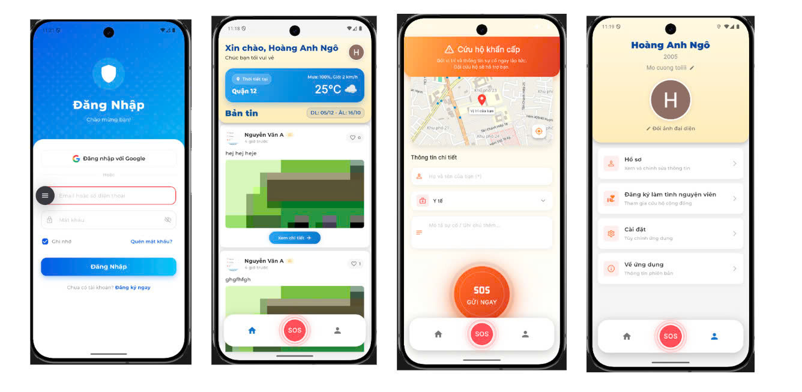

# 🆘 AppSOS

> Ứng dụng cứu hộ khẩn cấp - Kết nối nhanh chóng người cần giúp đỡ với tình nguyện viên gần nhất


[](https://flutter.dev/) [](https://nodejs.org/) [](https://www.mongodb.com/)

---

## 📱 Giới Thiệu

**AppSOS** là hệ thống cứu hộ khẩn cấp kết nối người cần trợ giúp với tình nguyện viên trong vòng 5km. Ứng dụng sử dụng GPS, Firebase và thông báo thời gian thực để phản hồi nhanh chóng trong các tình huống khẩn cấp.



## ✨ Tính Năng Chính

### 🚨 Hệ Thống SOS
- Gửi tín hiệu SOS với vị trí GPS chính xác
- Tự động tìm kiếm tình nguyện viên trong bán kính 5km
- Theo dõi trạng thái trên bản đồ thời gian thực
- Cảnh báo âm thanh khi có người nhận yêu cầu

### 👥 Chức Năng Tình Nguyện Viên
- Dashboard quản lý yêu cầu SOS gần đó
- Chấp nhận/từ chối yêu cầu cứu hộ
- Lịch sử hoạt động tình nguyện
- Quản lý hồ sơ và trạng thái sẵn sàng

### 📰 Cộng Đồng
- Bản tin về an toàn và sơ cấp cứu
- Tạo và chia sẻ bài viết
- Upload hình ảnh lên AWS S3
- Tương tác với bài viết (like, comment)

### 🔐 Xác Thực & Bảo Mật
- Đăng nhập qua số điện thoại (OTP)
- Đăng nhập nhanh với Google Sign-In
- Firebase Authentication
- JWT token với cookie session

### 🌍 Tính Năng Khác
- Đa ngôn ngữ (Tiếng Việt/English)
- Chế độ sáng/tối (Dark mode)
- Thông báo đẩy thời gian thực (FCM)
- Responsive UI cho mọi kích thước màn hình

## 🛠️ Công Nghệ Sử Dụng

**Frontend:** Flutter 3.9.2, Provider, Google Maps, Geolocator, Firebase  
**Backend:** Node.js, Express, MongoDB, Firebase Admin SDK, AWS S3  

## ⚡ Cài Đặt & Chạy Dự Án

### 1️⃣ Clone Repository & Cài Dependencies

```bash
git clone <repository-url>
cd AppSOS

# Cài đặt Flutter dependencies
flutter pub get

# Cài đặt Backend dependencies
cd z_Backend && npm install
```

### 2️⃣ Cấu Hình Firebase

1. Tạo project tại [Firebase Console](https://console.firebase.google.com/)
2. Download và đặt các file:
   - `google-services.json` → `android/app/`
   - `GoogleService-Info.plist` → `ios/Runner/`
3. Xem hướng dẫn chi tiết: [`FLUTTER_FCM_GUIDE.md`](FLUTTER_FCM_GUIDE.md)

### 3️⃣ Cấu Hình Backend

```bash
cd z_Backend
cp .env.example .env
# Chỉnh sửa file .env với thông tin của bạn
```

**Biến môi trường quan trọng:**
```env
PORT=5000
HOST=0.0.0.0
MONGO_URI=mongodb://localhost:27017/sos_app
JWT_SECRET=your-secret-key-here
JWT_EXPIRES_IN=7d
```

Chi tiết: [`z_Backend/ENV_TEMPLATE.md`](z_Backend/ENV_TEMPLATE.md)

### 4️⃣ Chạy Ứng Dụng

**Backend:**
```bash
cd z_Backend
npm start
# Server sẽ chạy tại http://localhost:5000
```

**Flutter App (terminal mới):**
```bash
# Về thư mục gốc
cd ..

# Xem danh sách devices
flutter devices

# Chạy app
flutter run

# Hoặc chạy trên device cụ thể
flutter run -d <device-id>
```

> **⚠️ Lưu ý quan trọng:** Đổi API URL trong `lib/services/api_service.dart`:
> - **Android Emulator:** `http://10.0.2.2:5000/api`
> - **iOS Simulator:** `http://localhost:5000/api`
> - **Thiết bị thật:** `http://<IP_MÁY_TÍNH>:5000/api`

## 📁 Cấu Trúc Dự Án

```
AppSOS/
├── lib/
│   ├── main.dart                      # Entry point
│   ├── screens/                       # Màn hình UI
│   │   ├── login_screen.dart
│   │   ├── signup_screen.dart
│   │   ├── sos_emergency_screen.dart
│   │   ├── sos_searching_screen.dart
│   │   ├── sos_accepted_screen.dart
│   │   ├── volunteer_dashboard_screen.dart
│   │   ├── blog_page.dart
│   │   └── ...
│   ├── services/                      # Business logic & API
│   │   ├── api_service.dart          # REST API calls
│   │   ├── auth_service.dart         # Firebase Auth
│   │   ├── fcm_service.dart          # Push notifications
│   │   └── ...
│   ├── providers/                     # State management
│   │   ├── active_sos_provider.dart
│   │   ├── locale_provider.dart
│   │   └── theme_provider.dart
│   ├── models/                        # Data models
│   ├── widgets/                       # Reusable components
│   └── utils/                         # Utilities
│
└── z_Backend/
    ├── server.js                      # Server entry point
    ├── controllers/                   # Business logic
    ├── routes/                        # API routes
    ├── models/                        # MongoDB schemas
    ├── middleware/                    # Auth, validation
    └── services/                      # Helper services
```

## 🔧 Build Production

### Android

```bash
# Build APK
flutter build apk --release

# Build App Bundle (cho Google Play)
flutter build appbundle --release
```

File output:
- APK: `build/app/outputs/flutter-apk/app-release.apk`
- AAB: `build/app/outputs/bundle/release/app-release.aab`

### iOS

```bash
flutter build ios --release
```

## 📖 Tài Liệu

| Tài liệu | Mô tả |
|----------|-------|
| [`FLUTTER_FCM_GUIDE.md`](FLUTTER_FCM_GUIDE.md) | Hướng dẫn cấu hình FCM push notifications |
| [`z_Backend/README.md`](z_Backend/README.md) | Backend API documentation đầy đủ |
| [`z_Backend/TESTING_GUIDE.md`](z_Backend/TESTING_GUIDE.md) | Hướng dẫn test API với Postman/cURL |
| [`z_Backend/AWS_S3_SETUP_GUIDE.md`](z_Backend/AWS_S3_SETUP_GUIDE.md) | Cấu hình upload ảnh lên S3 |

## 🎯 Hướng Dẫn Sử Dụng

### Đăng Ký/Đăng Nhập
1. Mở app → Chọn "Đăng ký" nếu là người dùng mới
2. Nhập: Họ tên, Số điện thoại, Mật khẩu
3. Hoặc đăng nhập nhanh bằng Google

### Gửi SOS
1. Tab "SOS" → Nhấn "Gửi SOS khẩn cấp"
2. Chọn loại khẩn cấp (Y tế, Tai nạn, Cháy nổ, v.v.)
3. Nhập mô tả chi tiết tình huống
4. Nhấn "Gửi SOS" → Hệ thống tự động tìm tình nguyện viên
5. Chờ tình nguyện viên chấp nhận và xem vị trí trên bản đồ

### Trở Thành Tình Nguyện Viên
1. Tài khoản → "Đăng ký làm tình nguyện viên"
2. Điền thông tin: CMND, Chứng chỉ (nếu có), v.v.
3. Sau khi được duyệt → Bật "Chế độ tình nguyện viên"
4. Nhận thông báo khi có SOS gần đó

### Đọc & Tạo Bài Viết
1. Tab "Bản tin" → Xem các bài viết
2. Nhấn "+" để tạo bài viết mới
3. Thêm tiêu đề, nội dung, hình ảnh
4. Đăng bài để chia sẻ với cộng đồng

## � Xử Lý Lỗi Thường Gặp

### ❌ Lỗi kết nối Backend

**Triệu chứng:** Cannot connect to server, timeout  
**Giải pháp:**
- Kiểm tra backend đang chạy: mở `http://localhost:5000/health` trên trình duyệt
- Đổi IP trong `lib/services/api_service.dart` (dòng 15)
- Với emulator Android: dùng `10.0.2.2` thay vì `localhost`
- Với thiết bị thật: dùng IP của máy tính (cùng WiFi)

### ❌ Lỗi Firebase

**Triệu chứng:** Firebase initialization failed  
**Giải pháp:**
- Đảm bảo đã download `google-services.json` và `GoogleService-Info.plist`
- Kiểm tra package name trong Firebase Console khớp với app
- Xem log chi tiết: `flutter run -v`

### ❌ Lỗi Google Maps

**Triệu chứng:** Map không hiển thị, blank screen  
**Giải pháp:**
- Bật Google Maps SDK trên Google Cloud Console
- Thêm API key vào:
  - Android: `android/app/src/main/AndroidManifest.xml`
  - iOS: `ios/Runner/AppDelegate.swift`
- Kiểm tra billing đã bật cho Google Cloud project

### ❌ Lỗi Build

**Triệu chứng:** Build failed với lỗi dependencies  
**Giải pháp:**
```bash
# Clean project
flutter clean
flutter pub get

# Rebuild
flutter run
```

## � API Chính

### Authentication
- `POST /api/auth/register` - Đăng ký
- `POST /api/auth/login` - Đăng nhập
- `GET /api/auth/me` - Lấy thông tin user

### SOS
- `POST /api/sos` - Tạo SOS case
- `POST /api/sos/:id/accept` - Chấp nhận SOS
- `POST /api/sos/:id/decline` - Từ chối SOS
- `POST /api/sos/:id/cancel` - Hủy SOS
- `GET /api/sos/:id` - Chi tiết SOS

### Articles
- `GET /api/articles` - Danh sách bài viết
- `POST /api/articles` - Tạo bài viết
- `POST /api/articles/:id/like` - Thích bài viết

Xem chi tiết: [`z_Backend/README.md`](z_Backend/README.md)

## 📞 Liên Hệ & Hỗ Trợ

**Phản hồi & Báo lỗi:** Vui lòng liên hệ nhóm phát triển

---

<div align="center">

**Made with ❤️ using Flutter & Node.js**

</div>
